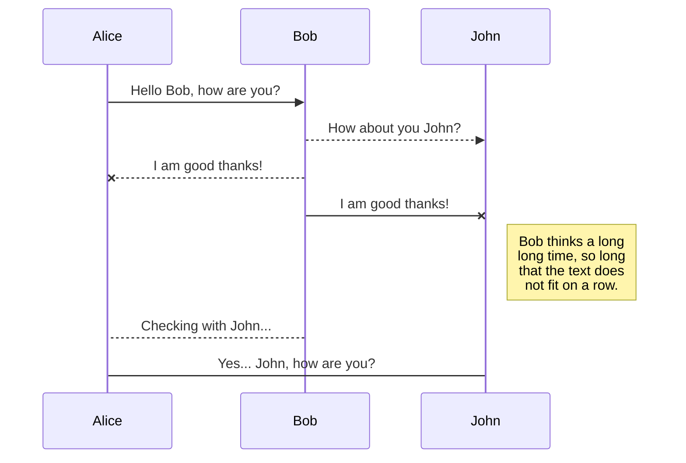
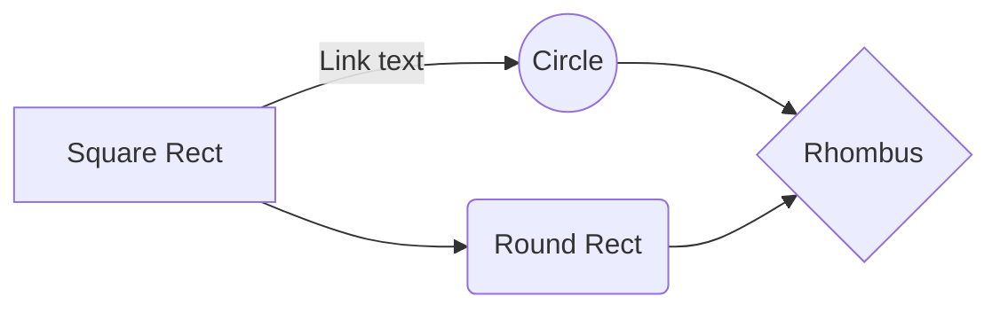

# CCLoader Documentation

This file will contain handy things to know about CCLoader and the CrossCode DevTools console.


# Files

1.  Download the repository by left clicking on the  `Clone or download`  and left click on  `Download Zip`.
2.  Unzip the zip file.
3.  Copy the contents of the folder into your CrossCode installation folder.

## Difference between Scripts and Console

They are both JavaScript code and have the same effect but scripts are loaded at specific times specified in [https://github.com/CCDirectLink/CLS/blob/master/proposals/1/standardized-mod-format.md](https://github.com/CCDirectLink/CLS/blob/master/proposals/1/standardized-mod-format.md "https://github.com/CCDirectLink/CLS/blob/master/proposals/1/standardized-mod-format.md") . That doc also tells you how the `package.json` file is structured.

## A new technique

There is a new technique used for new mods that replaces the old "stage" entries in the package.json that isn't yet in the spec. If you specify a script as "plugin" in the package.json then you can use a exported class that extends "Plugin" to combine multiple stages in a script:

```JS
/// <reference path="../../../ccloader/js/types/plugin.d.ts" />

/**
 * @extends {ccloader.Plugin}
 */
export default class Test extends Plugin {

    /**
     * 
     * @param {ccloader.Mod[]} mods 
     */
    constructor(mods) {
        super();

        this.mods = mods;
    }

    preload() {
        console.log('Called in preload');
    }

    postload() {
        console.log('Called in postload');
    }

    prestart() {
        console.log('Called in prestart');
    }
    
    main() {
        console.log('Called in main');
    }
}
```
## Variables

About how to find out what variables to use: You first have to understand how CrossCode's code is structured. For that you probably want to beautify the code (game.compiled.js) first: [https://beautifier.io/](https://beautifier.io/ "https://beautifier.io/") .

## Structure

It starts with some utility code and then with modules. Every module starts with module - recognized by `ig.module("name").requires(...).defines(function() { ... })` - has a name requirements and a body. These modules are just groups of related code. You could make a tool that puts it into different files but then you'd end up with 100 files to look through.

## Export a file

You can export the current file by clicking **Export to disk** in the menu. You can choose to export the file as plain Markdown, as HTML using a Handlebars template or as a PDF.


## Important Variables


All important variables are either in the `sc` or the `ig` object. As far as I can tell they are "prototype" and "runtime" objects respectively but I am not so sure about that.

## Constant Values

Constant values (and enums) are usually in written in CAPS_WITH_UNDERSCORES, are found at the root of a module and look like this:
```JS
ig.module("name").requires("others").defines(function() {
    //...

    sc.GAME_MOBILITY_BLOCK = {
        NONE: {},
        TELEPORT: {
            teleportBlock: true
        },
        SAVE: {
            teleportBlock: true,
            saveBlock: true
        },
        CHECKPOINT: {
            teleportBlock: true,
            saveBlock: true,
            checkpointBlock: true
        },
        NO_MAP_LEAVE: {
            teleportBlock: true,
            saveBlock: true,
            checkpointBlock: true,
            mapLeaveBlock: true
        }
    };

    //...
})
```
## Checking Variable Arguments

If you enter `sc.GAME_MOBILITY_BLOCK` you will get a list of 'NONE', 'TELEPORT', 'SAVE', 'CHECKPOINT' and 'NO_MAP_LEAVE'.(edited)

Classes are also always found at the root of a module and always look like this:

```JS
ig.module("name").requires("others").defines(function() {
    //...

    ig.Name = ig.Class.extends({
        variableA: 1,
        variableB: "asdf",
        init: function(a, b, c) {
            //This is the constructor with the args a, b, c
        },
        funcA: function() {
            this.funcB(); //The other func can be called using "this"
        },
        funcB: function() {
            console.log(this.variableB); //Variables can be used using "this"
        }
    })

    //...
})
```
## Referencing 

Once your file is linked to a synchronized location, StackEdit will periodically synchronize it by downloading/uploading any modification. A merge will be performed if necessary and conflicts will be resolved.

If you just have modified your file and you want to force syncing, click the **Synchronize now** button in the navigation bar.

> **Note:** The **Synchronize now** button is disabled if you have no file to synchronize.

## Manage file synchronization

Since one file can be synced with multiple locations, you can list and manage synchronized locations by clicking **File synchronization** in the **Synchronize** sub-menu. This allows you to list and remove synchronized locations that are linked to your file.


# Publication

Publishing in StackEdit makes it simple for you to publish online your files. Once you're happy with a file, you can publish it to different hosting platforms like **Blogger**, **Dropbox**, **Gist**, **GitHub**, **Google Drive**, **WordPress** and **Zendesk**. With [Handlebars templates](http://handlebarsjs.com/), you have full control over what you export.

> Before starting to publish, you must link an account in the **Publish** sub-menu.

## Publish a File

You can publish your file by opening the **Publish** sub-menu and by clicking **Publish to**. For some locations, you can choose between the following formats:

- Markdown: publish the Markdown text on a website that can interpret it (**GitHub** for instance),
- HTML: publish the file converted to HTML via a Handlebars template (on a blog for example).

## Update a publication

After publishing, StackEdit keeps your file linked to that publication which makes it easy for you to re-publish it. Once you have modified your file and you want to update your publication, click on the **Publish now** button in the navigation bar.

> **Note:** The **Publish now** button is disabled if your file has not been published yet.

## Manage file publication

Since one file can be published to multiple locations, you can list and manage publish locations by clicking **File publication** in the **Publish** sub-menu. This allows you to list and remove publication locations that are linked to your file.


# Markdown extensions

StackEdit extends the standard Markdown syntax by adding extra **Markdown extensions**, providing you with some nice features.

> **ProTip:** You can disable any **Markdown extension** in the **File properties** dialog.


## SmartyPants

SmartyPants converts ASCII punctuation characters into "smart" typographic punctuation HTML entities. For example:

|                |ASCII                          |HTML                         |
|----------------|-------------------------------|-----------------------------|
|Single backticks|`'Isn't this fun?'`            |'Isn't this fun?'            |
|Quotes          |`"Isn't this fun?"`            |"Isn't this fun?"            |
|Dashes          |`-- is en-dash, --- is em-dash`|-- is en-dash, --- is em-dash|


## KaTeX

You can render LaTeX mathematical expressions using [KaTeX](https://khan.github.io/KaTeX/):

The *Gamma function* satisfying $\Gamma(n) = (n-1)!\quad\forall n\in\mathbb N$ is via the Euler integral

$$
\Gamma(z) = \int_0^\infty t^{z-1}e^{-t}dt\,.
$$

> You can find more information about **LaTeX** mathematical expressions [here](http://meta.math.stackexchange.com/questions/5020/mathjax-basic-tutorial-and-quick-reference).


## UML diagrams

You can render UML diagrams using [Mermaid](https://mermaidjs.github.io/). For example, this will produce a sequence diagram:



And this will produce a flow chart:


<!--stackedit_data:
eyJoaXN0b3J5IjpbMjYyOTQwMzg5LC0xOTk2OTg1MjI5LC0zMz
I0NTUzNjNdfQ==
-->